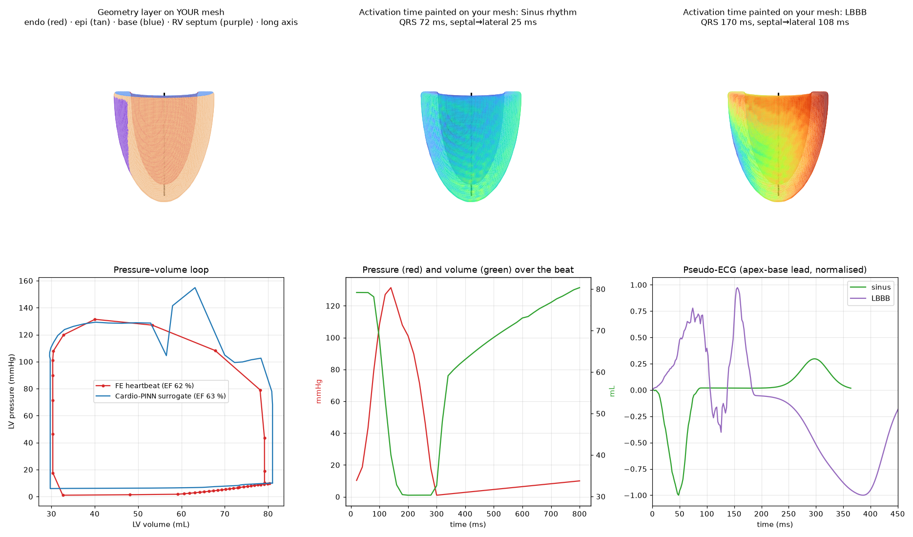

# CardioSolv Digital Twin — Isaac Sim 6 extension

CardioSolv turns **the heart you select in the stage** into a biomechanical and
electrophysiological digital twin, and paints/animates the results **on your own
mesh**. It never generates a replacement heart: your geometry is the source of
truth, and every CardioSolv opinion lives in two sublayers that can be muted or
deleted at any time.

```
DICOM CT / MR  ── 0 Imaging ───────── NV-Segment-CTMR / TotalSegmentator -> heart.usda (imaging/ package)
   │
Selected heart prim (your USD)
   │  1 Anatomy discovery ── parts in world mm, explainable role scores (names + geometry)
   │  2 Geometry layer ───── myocardium · endocardium / epicardium / base / RV-septum · long axis · landmarks
   │  3 Mesh + fibres ────── conforming tets snapped to your surface · x_t, x_l, x_c · helix/sheet fibres
   │  4 Electrophysiology ── eikonal or Mitchell–Schaeffer monodomain · sinus / LBBB / RV pacing / CRT · pseudo-ECG
   │  5 Biomechanics ─────── Holzapfel–Ogden + EP-driven active tension + 3-element Windkessel heartbeat
   │  6 Cardio-PINN ──────── parametric PINN surrogate (PhysicsNeMo backbone if installed) · EF personalisation
   ▼  7 Twin on your mesh ── time-sampled points + colours on your prims · fibres · VTK / openCARP / JSON report
```



## Stage 0: from DICOM

Install the segmentation package from `imaging/` on a GPU machine. Either install it locally
with `pip install ".[nvsegment,totalsegmentator]"` and run `scripts/setup_models.sh`, or start
it as a Docker service (see `imaging/README.md`). Then in the panel's **0 Imaging** section:

1. Enter the DICOM folder, or a NIfTI file.
2. Choose **local** (set *imaging Python* to that environment's interpreter) or **service**
   (set *Service URL*, e.g. `http://gpu-host:8040`).
3. Click **Segment & Load Heart**.

The heart is referenced at `/World/CardioSolvPatient/Patient/Heart` and selected for Stage 1.
Its parts are named `heart_myocardium`, `heart_ventricle_left`, ... so they are recognised with
HIGH confidence.

## Install

1. Copy or symlink `exts/cardiosolv.digitaltwin` into an extension search path, or add
   `<repo>/exts` under *Window → Extensions → ⚙ → Extension Search Paths*.
2. Enable **CardioSolv Digital Twin** in the Extensions window
   (*Window → CardioSolv Digital Twin* reopens the panel).
3. Requirements: `numpy`, `scipy` (bundled with Isaac Sim) and `torch` (bundled with Isaac Sim;
   needed for stages 5–6). Optional: `physicsnemo` (surrogate backbone), `gmsh` (graded meshing),
   `vmtk` (vessel centrelines), openCARP (external EP using the exported files).

## Use it

1. Open your heart USD and select the **heart root prim** (the Xform holding the parts).
2. *Use Selected Heart*, then run the stages in order (or *Run All Stages*).
3. **Stage 1** lists every mesh part with the role CardioSolv assigned
   (`Myocardium`, `LeftVentricle`, `RightVentricle`, `LeftAtrium`, `RightAtrium`, `Aorta`, …),
   its score and confidence class. Use the combo boxes to correct any role; later stages re-run.
4. **Stage 2** writes `/CardioSolv` (semantic `Scope`s, landmarks, long axis glyph) and adds
   `cardiosolv_Endocardium / _Epicardium / _Base / _RVSeptum` **GeomSubsets on your myocardium mesh**,
   with an optional colour preview.
5. **Stages 3–6** compute (off the UI thread). Stage 6 can personalise contractility to a
   measured EF (typed in, or fetched from the Echocardiology dashboard).
6. **Stage 7** animates every part under your heart (the myocardium exactly, neighbours with a
   distance fall-off) and paints the chosen field: activation time, transmembrane potential,
   active tension, fibre strain, fibre stress, displacement. Press *Play*.

Headless (Isaac Sim `python.sh`, or any Python with `usd-core`):

```bash
python scripts/run_pipeline.py heart.usd /World/Heart --protocol lbbb --target-ef 45 \
    --dashboard http://localhost:3000
```

## How the geometry layer works on an imported multi-part heart

* **Units / transforms** — every `UsdGeom.Mesh` under the selected prim (instance proxies and
  face `GeomSubset` parts included) is triangulated and transformed to world millimetres using
  `metersPerUnit`.
* **Finding the myocardium** — parts are voxelised (3-axis parity vote: tolerant of holes and
  non-manifold edges). A myocardial wall is recognised by *hollowness*: rays cast from its empty
  interior hit the wall from most directions (enclosed cavity), and a blood-pool part sits inside
  that cavity. Names (TotalSegmentator, VISTA-3D, MM-WHS, artist conventions) add evidence; anonymous
  scenes (`Mesh_001…`) are scored on geometry only and never reported as HIGH confidence.
  Without a myocardium part the LV wall is derived from the LV blood pool (flagged LOW).
* **Endocardium vs epicardium** — each face of *your* myocardium is classified by the tissue on
  its outward side: LV blood pool → endocardium, RV blood pool → RV septum, atria/great vessels or
  the flat basal cut → base, otherwise epicardium; then majority-smoothed over neighbours.
  Validated on Buoso's `Shape_model/LV_mean.vtk` (single anonymous prim, no blood pool):
  **100 % of endocardial and epicardial ground-truth vertices** classified correctly.
* **Long axis** — PCA axis whose apex/base sign is resolved by explicit votes (atria/great vessels,
  cavity opening vs apical cap, base wider than apex), then refined as apex → centre of the basal
  cavity opening. Matches the ground-truth apex→mitral axis of `LV_mean` (cos > 0.98).

> Note: `LV_mean.vtk` stores the **endocardium as label 2** and the epicardium as label 1 (label 2
> is the smaller inner shell, and `LoadModelAnatomy` takes the pressure surface from label 2). The
> Cardio-PINN README lists them the other way round.

## Skin-only hearts and non-anatomical scale

Many Omniverse heart assets (artist / generated / SimReady, e.g. `isaac_human_heart.usd`) are a single
closed **outer skin**: rays through them cross the surface twice and the enclosed volume is solid, so
there is no myocardium, chamber or septum to find. CardioSolv detects this (no wall-like part: local
thickness > 25 mm at anatomical scale) and switches to **skin mode** (`skin_mode = auto | on | off`):

* the skin is the epicardium; the base is the end whose cross-sections split into several great
  vessels, the apex the single tapering tip (stage up-axis as a weak prior);
* the AV plane is the waist of the cross-section area profile (fallback 62 % of the heart length);
* the LV lies on the side the apex is offset to; a septal plane gives the LV ~62 % of the width;
* walls use reference thicknesses (LV 10 mm, septum 10 mm, RV 4 mm);
* the epicardial wall of the computational mesh is snapped to your skin, and your skin gets
  `cardiosolv_LVEpicardium / _RVFreeWall / _AtriaGreatVessels` GeomSubsets;
* results are painted on your skin (fading to grey over the RV free wall / atria, which follow the
  motion), and the derived endocardium is shown as `/CardioSolv/Debug/AssumedEndocardium`.

Everything derived is flagged **ASSUMED** and validation reports `REQUIRES ANATOMICAL VALIDATION`.
Flip the apex/base or LV/RV sides from the panel if the asset is unusual.

**Auto-scale**: assets outside 60–200 mm (the example heart is 1.1 m tall at `metersPerUnit = 1`)
are simulated in an anatomical frame (heart length 120 mm) and mapped back at the displayed size.

## Biventricular twin

By default (`biventricular = True`) the twin simulates both ventricles:

* **RV free wall**: taken from an RV myocardium part when the heart has one, otherwise derived as a
  `rv_wall_mm` (3.5 mm) shell around your RV blood pool, kept only where it is connected to the LV wall
  (flagged in the geometry warnings). Skin mode uses its assumed 4 mm RV wall.
* **Mesh**: one conforming tet mesh, region 0 = LV wall + septum, region 1 = RV free wall; RV
  endocardium = the `RVSeptum` surface class (septal + free-wall RV side). Your LV myocardium
  surface is snapped as before, the derived RV wall is smoothed.
* **Fibres**: two transmural fields (LV endo 0 -> epi / RV endo 1 for the LV and septum, RV endo 0 ->
  epi 1 for the RV free wall), each with its own helix rotation.
* **EP**: separate LV and RV Purkinje layers. Sinus uses both; LBBB keeps the right bundle (RV
  activated early, LV free wall late); RV pacing and CRT conduct retrogradely through the right bundle.
  Reports `rv_total_activation_ms` and `interventricular_delay_ms`.
* **Mechanics**: one energy with an LV and an RV cavity term, so the septum is loaded by both
  pressures (ventricular interdependence comes out of the mechanics). Each ventricle has its own valve
  state machine; the LV ejects into the systemic and the RV into a pulmonary 3-element Windkessel
  (`pvr`, `c_pulmonary`, `p_pulmonary_diastolic`, `rv_edp_mmhg`).
* **Surrogate**: inputs `(p_LV, p_RV, t, s)`; the surrogate beat solves both ventricles by Gauss–Seidel.
* **Outputs**: RVEDV/RVESV/RVEF, RV peak pressure, PA systolic/diastolic, RV/LV EDV ratio, RV PV loop
  in the report and the dashboard; the RV parts of your heart are painted too.

Set `biventricular = False` (panel: *Biventricular*) for the LV-only twin of earlier versions.

## Physics

| Stage | Model | Notes |
|---|---|---|
| Fibres | Cardio-PINN `GenerateFibers` (vectorised) | helix +60° endo → −60° epi, sheet γ = −65° |
| EP | anisotropic eikonal (fast endocardial layer ≈ Purkinje) or Mitchell–Schaeffer monodomain | sinus QRS ≈ 70 ms, LBBB ≈ 170 ms, CRT resynchronises |
| Passive | Holzapfel–Ogden, Sack et al. 2018 parameters (as Cardio-PINN), stiffness scale 0.75 | isochoric invariants + volumetric penalty |
| Active | `T_a(x,t) = T_max · twitch(t − t_act(x))` along fibres | EP → mechanics coupling per element |
| Circulation | 3-element Windkessel, implicit; isovolumetric phases by augmented Lagrangian | one energy minimisation per step |
| Surrogate | Cardio-PINN parametric PINN: `(p, t, s) → POD amplitudes`, energy loss + FE anchors | PhysicsNeMo `FullyConnected` when available |

On the bundled synthetic heart: EDV 79 mL, ESV 30 mL, **EF 62 %**, LV peak 131 mmHg,
aortic 131/68 mmHg, peak fibre strain −15 %, myocardial volume preserved to 0.04 %.

**Transverse active stress.** Cardio-PINN adds `0.3·((I4s−1)+(I4n−1))` to the active energy.
With isochoric invariants this term behaves like an isotropic active stiffening that opposes wall
thickening, and on the same anatomy it lowers EF from 62 % to 40 %. The default here is therefore
`eta_transverse = 0`; set it to 0.3 to reproduce Cardio-PINN's formulation.

## Outputs

* `<stage>_cardiosolv.usda`: semantic layer, GeomSubsets, landmarks, axis.
* `<stage>_cardiosolv_twin.usdc`: time-sampled points/colours/primvars on your prims, fibres.
* `<stage>_twin.usda` (*Save Twin Stage* / CLI): a thin stage whose sublayers are
  `[twin results, semantics, your original file]`. Open it to replay the twin; your file is untouched.

USD layering note: sublayers are weaker than the root layer. When the heart is referenced into
the scene (the usual Isaac Sim case) the CardioSolv sublayers override it directly. When the meshes
are defined in the opened file itself, the live animation is authored in the session layer, and
*Save Twin Stage* moves it into the twin layer underneath the thin stage.
* `cardiosolv_output/cardiosolv_report.json`: anatomy, QC, EP, PV loop, surrogate, calibration.
* `cardiosolv_output/opencarp/`: `.pts/.elem/.lon`, stimulus `.vtx`, `.par` template.
* `cardiosolv_output/vtk/`: ParaView series (displacement, Vm, active tension, fibre strain/stress).

## Tests

```bash
cd exts/cardiosolv.digitaltwin && pip install numpy scipy usd-core torch scikit-image vtk pytest
python -m pytest
```

## Limitations (research prototype — not for clinical use)

* Quasi-static mechanics; lumped (0D) haemodynamics instead of 3D FSI; atria are not simulated
  (prescribed filling pressures), so a single beat need not balance LV and RV stroke volumes.
* A derived RV wall is a uniform 3.5 mm shell; at 3–4 mm elements it is one or two elements thick, so
  RV wall stresses are coarse. Use an RV myocardium segmentation and smaller elements for RV studies.
* P1 tetrahedra with a penalty volumetric term; refine elements for stress quantities.
* Monodomain conduction velocity needs ≤ 1 mm elements to converge; the eikonal solver is the
  interactive default.
* The surrogate matches FE ejection fraction (63.5 vs 61.7 %; 33.6 vs 33.5 % at 0.6× contractility,
  mean volume error 0.9 mL) but can show pressure overshoots in early ejection; use the FE beat for
  pressure waveforms. EF above ~65 % may be out of the calibratable range (reported as such).
* If your heart asset is already animated (skinning/blend shapes), the twin's time samples override
  its points while the twin layer is active.
